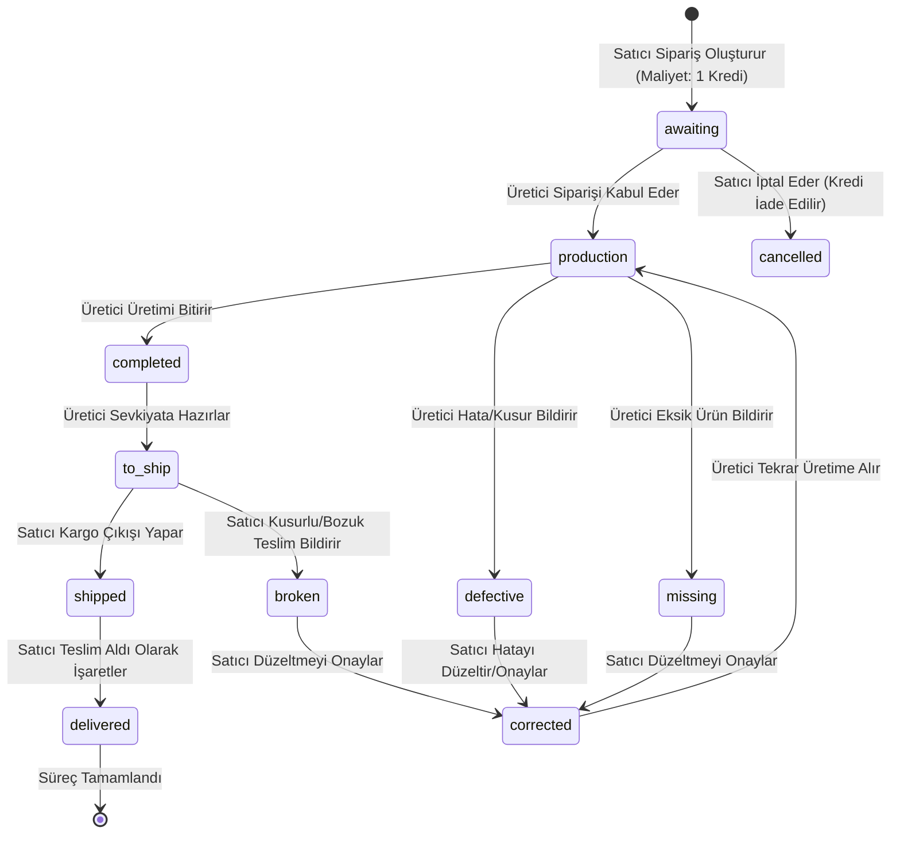

# GoodTrack — Proje Bilgi Belgesi (PROJECT_KNOWLEDGE)

> **Son Güncelleme:** 28 Haziran 2026  
> **Amaç:** Bu belge, bir yapay zeka ajanının GoodTrack projesini kaynak kodlarını tek tek taramak zorunda kalmadan en küçük detayına kadar tam olarak anlaması için hazırlanmıştır. Bu belgeyi okuduktan sonra proje mimarisini, dosya sorumluluklarını, veritabanı şemasını, API endpoint'lerini, SignalR mekanizmalarını, kredi sistemini, yetkilendirmeleri ve bilinen teknik borçları eksiksiz bir şekilde kavramış olacaksınız.

---

## 1. Proje Özeti ve İş Mantığı

**GoodTrack**, satıcılar (seller) ile üreticiler (manufacturer / mfr) arasındaki B2B üretim sipariş süreçlerini ve ürün takip akışlarını yöneten bir web uygulamasıdır. 

### Temel İş Kuralları:
- **Satıcılar (Seller):** Sipariş oluşturur, katalog yönetir, üretici arar, bağlantı (connection) isteği gönderir ve ürünlerin durumlarını takip eder.
- **Üreticiler (Mfr):** Kendilerine atanan siparişleri üretime alır, tamamlar, hatalı veya eksik (defect/missing) durumlarını bildirir.
- **Gerçek Zamanlılık:** Sipariş durum değişiklikleri, yeni bağlantı istekleri ve güncellemeler **SignalR** ile anlık olarak karşı tarafa iletilir.
- **Redesign Kuralı:** Frontend tarafında yapılan tüm yeni geliştirmeler **yalnızca `client-app-redesign` projesi üzerinde** gerçekleştirilmelidir. Eski `client-app` projesi pasiftir ve dokunulmamalıdır.

### Kullanıcı Rolleri:
| Rol | Türkçe Karşılığı | Yetki / Sorumluluk Özeti |
|-----|------------------|--------------------------|
| `seller` | Satıcı | Sipariş oluşturma/güncelleme/silme, katalog yönetimi, ekstra alan tanımlama, bağlantı isteği atma, teslim onaylama |
| `mfr` | Üretici | Sipariş kabul etme, üretime alma, tamamlama, hata/eksik bildirme, iptal taleplerini onaylama/reddetme |
| `admin` | Yönetici | Yalnızca sistem yönetimi ve toplu durum geçiş/migrasyon işlemleri |

---

## 2. Teknoloji Stack'i

### Backend (.NET Web API)
- **Framework:** ASP.NET Core (.NET 9)
- **Veritabanı ORM:** Entity Framework Core 9 + Npgsql (PostgreSQL 17)
- **Veritabanı Sunucusu:** Supabase (PostgreSQL 17.6)
- **İsimlendirme Standardı:** EFCore Naming Conventions ile veritabanında `snake_case`, C# tarafında `PascalCase` eşlemesi.
- **Kimlik Doğrulama:** JWT Bearer Token (12 Saat Access Token, 7 Gün Refresh Token ömrü).
- **Gerçek Zamanlı Bildirimler:** SignalR Hub (`/hubs/tracking`).
- **Hız Sınırlama (Rate Limiting):** ASP.NET Core yerleşik rate limiter (`auth-strict` için 5/dk, genel API için 60/dk).
- **Görsel Depolama:** `Base64ImageStorageService` ile Base64 verilerinin kontrolü ve PostgreSQL tablolarında saklanması.
- **Loglama:** Serilog (Console ve günlük JSON dosyası tabanlı `logs/goodtrack-.json`).

### Frontend (React App Redesign)
- **Framework:** React 18 + TypeScript + Vite
- **Yönlendirme (Routing):** React Router DOM v6
- **Real-Time Client:** `@microsoft/signalr`
- **Stil Yönetimi:** Vanilla CSS (`index.css` ve CSS Modules) — TailwindCSS veya harici UI kütüphanesi kullanılmıyor.
- **İkonlar:** `lucide-react`

### Test Suite (`GoodTrack.API.Tests`)
- **Teknoloji:** xUnit + FluentAssertions + Microsoft.EntityFrameworkCore.InMemory
- **Test Edilen Katmanlar:** `AuthService`, `CreditsService`, `Product` durum geçiş kuralları (`ProductStatus` testleri).

---

## 3. Dizin Yapısı ve Dosya Dağılımı

```
GoodTrack/
├── .github/workflows/
│   └── ci.yml                  ← GitHub Actions Sürekli Entegrasyon (Build & Test)
├── GoodTrack.API.Tests/         ← Backend Birim Testleri
│   ├── AuthServiceTests.cs     ← Kayıt, Giriş, Profil ve Bağlantı testleri
│   ├── CreditsServiceTests.cs  ← Bakiye, Plan ve Concurrency (Çakışma) testleri
│   └── ProductStatusTransitionTests.cs ← Durum geçiş izinleri testleri
│
├── GoodTrack.API/               ← Backend Projesi (.NET 9)
│   ├── Abstractions/
│   │   ├── Repositories/       ← Repository Interface'leri (IUserRepository, IProductRepository, vb.)
│   │   └── Services/           ← İş Mantığı Interface'leri (IAuthService, ICreditsService, vb.)
│   ├── Constants/
│   │   ├── OrderStatus.cs      ← Tüm sipariş durumu sabit dize değerleri
│   │   └── Roles.cs            ← Kullanıcı rol sabitleri ("seller", "mfr", "admin")
│   ├── Controllers/            ← API Denetleyicileri (Auth, Products, Connections, Credits, vb.)
│   ├── DTOs/                   ← Veri Taşıma Nesneleri (Request/Response Modelleri)
│   ├── Hubs/
│   │   └── TrackingHub.cs      ← SignalR WebSocket sunucu hub'ı
│   ├── Infrastructure/
│   │   ├── AppDbContext.cs     ← DB şeması, PostgreSQL eşlemeleri ve veritabanı bağlamı
│   │   └── Repositories/       ← EF Core & PostgreSQL somut repository sınıfları
│   ├── Migrations/             ← EF Core Veritabanı Migrasyon Geçmişi
│   ├── Middlewares/
│   │   └── ExceptionHandlingMiddleware.cs ← Hata yakalama ve güvenli hata döndürme katmanı
│   ├── Models/                 ← Veritabanı Entity sınıfları (User, Product, UserConnection, UserCredit, vb.)
│   ├── Services/               ← Business Logic servisleri (AuthService, ProductService, CreditsService, vb.)
│   ├── Program.cs              ← Uygulama başlangıç, DI konteyner konfigürasyonu ve middleware boru hattı
│   └── appsettings.json        ← Yerel yapılandırma dosyaları (gitignore'da)
│
└── client-app-redesign/         ← Aktif React Frontend Projesi
    ├── src/
    │   ├── App.tsx             ← Provider hiyerarşisi ve rota sarmalayıcıları
    │   ├── routes/
    │   │   └── AppRoutes.tsx   ← Tüm korumalı ve genel sayfa rotaları
    │   ├── components/
    │   │   ├── Layout.tsx      ← Sayfa iskeleti, Navigasyon, Dil/Tema Seçici ve CreditsWidget
    │   │   ├── auth/           ← Giriş/Kayıt ve Doğrulama Sayfaları
    │   │   ├── catalog/        ← Ürün Kataloğu CRUD arayüzleri
    │   │   ├── connections/    ← Bağlantı istekleri ve Bağlı Kullanıcılar listesi
    │   │   ├── credits/        ← Kredi Satın Alma / Abonelik Paneli (CreditsPage)
    │   │   ├── mfr/            ← Üretici Paneli ve sipariş kartları
    │   │   ├── seller/         ← Satıcı Paneli, Sipariş Verme Formu ve Akıllı Üretici Arama
    │   │   └── ui/             ← Modal, Toast, Lightbox, Sanal Ödeme Modalı
    │   ├── context/            ← React Context yapıları (Auth, Data, Settings, SignalR, vb.)
    │   ├── hooks/              ← Sayfalardan izole edilmiş iş mantığı custom hook'ları (13 dosya)
    │   ├── services/
    │   │   ├── api.ts          ← Tüm API fetch istekleri, base_url ayarları ve TS tipleri
    │   │   └── translations.ts ← TR/EN dil çeviri sözlüğü
    │   ├── types/              ← Arayüz tipleri ve filtre tanımları
    │   └── utils/              ← Yardımcı araçlar (durum renkleri, görsel küçültme, hata ayıklama)
```

---

## 4. Veritabanı Şeması (PostgreSQL Tabloları)

Tüm şema `GoodTrack.API/Infrastructure/AppDbContext.cs` içinde EF Core Fluent API ile tanımlanmıştır.

### 4.1. `users` Tablosu
Kullanıcı bilgilerini saklar. `associated_user_ids` kolonu silinmiş, yerine `user_connections` tablosu getirilmiştir.
- **Id** (`text`, PK): `gen_random_uuid()::text` ile atanır.
- **Username** (`varchar(100)`): Küçük harfli ve benzersizdir. UNIQUE indekslidir.
- **PasswordHash** (`text`): PBKDF2 standardında şifrelenmiştir.
- **Role** (`varchar(20)`): `"seller"` veya `"mfr"`.
- **Email** (`varchar(200)`): UNIQUE indekslidir.
- **ProfilePicture** (`text`): Base64 formatında saklanan profil görseli.
- **City** (`varchar(100)`): Üretici aramaları için case-insensitive arama kolonu.
- **Keywords** (`text[]`): Üreticinin uzmanlık alanları.
- **ProductImages** (`text[]`): Üretici portföy galeri görselleri (Base64 listesi).
- **IsVisibleToSellers** (`boolean`): Satıcı aramalarında listelensin mi?
- **RowVersion** (`xid` / `uint`): Eşzamanlı (concurrency) güncelleme çakışmalarını önlemek için PostgreSQL sistem kolonu `xmin` ile eşlenmiştir. `[RowVersion]` attribute'una sahiptir.

### 4.2. `user_connections` Tablosu
İlişkisi onaylanmış Satıcı-Üretici çiftlerini tutar.
- **Id** (`text`, PK): Benzersiz UUID.
- **SellerId** (`varchar(100)`): Satıcının kullanıcı ID'si.
- **ManufacturerId** (`varchar(100)`): Üreticinin kullanıcı ID'si.
- **ConnectedAt** (`varchar(50)`): Bağlantı zamanı (ISO 8601 string).
- *Benzersizlik:* `(seller_id, manufacturer_id)` üzerinde UNIQUE index bulunur.

### 4.3. `connection_requests` Tablosu
Kullanıcılar arasındaki arkadaşlık/bağlantı isteklerini yönetir.
- **SenderId** & **SenderUsername** (`varchar`): İsteği atan taraf.
- **ReceiverId** & **ReceiverUsername** (`varchar`): İsteği alan taraf.
- **Status** (`varchar(20)`): `"pending"`, `"accepted"`, `"rejected"`.

### 4.4. `products` Tablosu (Siparişler)
Tüm siparişlerin detaylarını ve geçmiş loglarını saklar.
- **Id** (`text`, PK): Benzersiz UUID.
- **Code** (`varchar(100)`): Sipariş kodu.
- **Image** / **DefectImage** (`text`): Sipariş veya hata görselleri (Base64).
- **Status** (`varchar`): Güncel durum (bkz: Bölüm 5).
- **Extras** (`jsonb`): Siparişe eklenen dinamik alan anahtar-değer çiftleri (örneğin `{ "Renk": "Kırmızı" }`).
- **Logs** (`jsonb`): Yapılan tüm durum geçişlerinin tarihçesi (`List<OrderLog>`).
- **SellerId** & **ManufacturerId** (`varchar(100)`): İlgili tarafların ID'leri.
- **CancelRequested** (`boolean`): Satıcı iptal talebi gönderdiğinde `true` olur.

### 4.5. `user_credits` Tablosu
Kullanıcıların bakiye ve abonelik bilgilerini saklar.
- **UserId** (`text`, FK -> `users.id`): UNIQUE foreign key. Her kullanıcının en fazla bir kredi kaydı olabilir.
- **Plan** (`text`): Kullanıcının abonelik seviyesi (`"Free"`, `"Pro"`, `"Enterprise"`).
- **Credits** (`integer`): Kullanıcının güncel harcanabilir kredi bakiyesi.
- **PlanStartedAt** & **RenewsAt** (`text`): Abonelik başlangıç ve otomatik yenilenme tarihleri.
- **RowVersion** (`xid`): Eşzamanlı bakiye güncellemelerinde (race condition) verinin ezilmesini engellemek için `xmin` concurrency token ile korunur.

### 4.6. `catalog_products` Tablosu
Satıcının hızlı sipariş geçmek için oluşturduğu şablon ürünler kataloğudur.

### 4.7. `extra_field_defs` Tablosu
Satıcıların sipariş formuna ekleyebileceği özel dinamik alan tanımlarıdır. (`Name`, `Type: "text"/"select"`, `Options: text[]`).

---

## 5. Sipariş Durum Akışı (Order Status Lifecycle)

Siparişler doğrusal olmayan karmaşık bir durum döngüsüne sahiptir. İşlemi yapan kullanıcının rolüne göre durum geçişleri `ProductService.cs` içindeki `UpdateOrderStatusAsync` metodunda katı kurallarla denetlenir.



### Durum Yetki Matrisi:
- **Sadece Satıcı (`seller`):** `to_ship` durumundaki ürünü `shipped` veya `broken` yapabilir. Siparişi `delivered` (teslim edildi), `cancelled` (iptal edildi) veya `corrected` (düzeltildi) durumuna çekebilir.
- **Sadece Üretici (`mfr`):** Yeni siparişi `production` (üretime alındı) durumuna alabilir. Üretimdeyken `completed`, `defective` (hatalı) veya `missing` (eksik) bildirebilir. `completed` olan ürünü `to_ship` durumuna getirebilir.
- **İptal Akışı (Cancel Request):** `production` durumuna geçmiş bir siparişi satıcı doğrudan iptal edemez. Öncelikle `CancelRequested = true` yapar (iptal talebi). Üretici onaylarsa durum `cancelled` olur ve satıcıya kredi iadesi yapılır; reddederse talep düşer.

---

## 6. Kredi ve Abonelik Sistemi

GoodTrack, B2B SaaS modeliyle çalışır. Satıcıların sipariş oluşturabilmesi için sistemde kredilerinin bulunması gerekir.

### Abonelik Paketleri:
- **Free:** Aylık 10 Kredi verilir, fiyatı 0$'dır. Ekstra alan tanımı yapılamaz.
- **Pro:** Aylık 100 Kredi verilir, fiyatı 29$'dır. En fazla 5 adet dinamik ekstra alan tanımına izin verilir.
- **Enterprise:** Sınırsız (`999999`) Kredi verilir, fiyatı 99$'dır. Sınırsız dinamik ekstra alan tanımlanabilir.

### Kredi Kuralları ve Tüketim:
1. **Sipariş Maliyeti:** Satıcı tarafından oluşturulan her 1 yeni sipariş, satıcının bakiyesinden **1 kredi** düşer.
2. **Kredi İade Politikası:** Eğer bir sipariş `awaiting` durumundayken satıcı tarafından iptal edilirse veya `production` aşamasındayken üretici iptal talebini onaylarsa, satıcıya **1 kredi otomatik olarak iade edilir**.
3. **Bakiye Kontrolü:** Kredisi 0 olan satıcı yeni sipariş oluşturamaz (`InsufficientCreditsException` fırlatılır).
4. **Eşzamanlılık Koruması (Concurrency):** İki farklı sekmeden veya işlemden aynı anda kredi düşülmeye/artırılmaya çalışılması durumunda PostgreSQL'in `xmin` yapısı tetiklenir, çakışma algılanır ve işlem güvenli bir şekilde iptal edilerek veritabanı tutarlılığı korunur.
5. **Sandbox Ödeme:** Frontend tarafında kart numarası kontrolü yapan bir sanal ödeme arayüzü (`MockPaymentModal`) mevcuttur.

---

## 7. API Uç Noktaları (Endpoint Listesi)

Tüm istekler `/api` ön ekiyle başlar. Kayıt ve Giriş dışındaki tüm endpointler geçerli bir JWT Token gerektirir.

### 7.1. Kimlik Doğrulama (`/api/auth`)
- `POST /auth/register` (Hız Sınırlı: 5/dk): Yeni hesap oluşturur.
- `POST /auth/login` (Hız Sınırlı: 5/dk): Kullanıcı adı ve şifreyi doğrular. Geriye JWT Token, Refresh Token ve Rol bilgisini döner.
- `POST /auth/refresh`: Access Token süresi bittiğinde Refresh Token ile yeni bir token seti üretir.
- `POST /auth/verify-password`: Hassas işlemler öncesi şifreyi doğrular.
- `POST /auth/change-password`: Şifreyi günceller.

### 7.2. Kullanıcı Bağlantıları (`/api/connections`)
- `GET /connections`: Onaylanmış tüm bağlı kullanıcıları döner.
- `POST /connections?username={x}`: Kullanıcı adına göre bağlantı/arkadaşlık isteği atar.
- `DELETE /connections/{targetId}`: Mevcut bağlantıyı tek taraflı sonlandırır.
- `GET /connections/requests/incoming` & `sent`: Gelen ve giden bağlantı isteklerini listeler.
- `PATCH /connections/requests/{requestId}`: İstek kabul (`status: "accepted"`) veya reddedilir.

### 7.3. Siparişler (`/api/products`)
- `GET /products`: Kullanıcının rolüne göre filtreli sipariş listesini getirir.
- `POST /products`: Yeni sipariş oluşturur (1 kredi düşer).
- `PUT /products/{id}`: Sipariş detaylarını günceller (Sadece satıcı).
- `PUT /products/{id}/status`: Sipariş durumunu günceller. Hata bildirimi için `defectNote` ve `defectImage` parametreleri bu istekte gönderilir.
- `POST /products/{id}/cancellation-requests`: İptal isteği başlatır.
- `PATCH /products/{id}/cancellation-requests`: İptal isteğini yanıtlar (`approve: true/false`).

### 7.4. Krediler ve Faturalandırma (`/api/credits`)
- `GET /credits/balance`: Kullanıcının güncel bakiyesini ve paket adını getirir.
- `GET /credits/plans`: Sistemdeki aktif paket detaylarını ve özelliklerini döndürür.
- `POST /credits/upgrade`: Paket yükseltme isteği gönderir. Sanal ödeme sonrasında tetiklenir.

### 7.5. Katalog ve Özel Alanlar (`/api/catalog`, `/api/fields`)
- Satıcıların hızlı sipariş oluşturmak için kullandığı katalog ve sipariş formunu özelleştiren dinamik alan tanımlarının CRUD işlemlerini içerir.

---

## 8. Frontend Mimari ve Optimistic UI Detayları

Frontend tasarımı, üstün bir kullanıcı deneyimi sunmak amacıyla **Semantik İyimser Güncelleme (Semantic Optimistic UI)** sistemiyle donatılmıştır.

### İyimser Güncelleme ve Kırpışma Önleme (Anti-Flicker):
- Sunucuya bir güncelleme isteği (örneğin sipariş durumunu tamamlama veya bağlantı silme) gönderildiğinde, arayüz sunucu yanıtını beklemeden anında güncellenir.
- Sunucudan SignalR veya HTTP kanalıyla gelecek mükerrer güncellemelerin veya yavaş yüklemelerin arayüzde titremeye (flicker) yol açmaması için `DataContext.tsx` içinde 15 saniyelik bir TTL (Time-To-Live) önbelleği (`Map`) tutulur.
- İstek hata verirse, `rollback` fonksiyonları tetiklenerek arayüz eski kararlı durumuna otomatik olarak geri döndürülür ve kullanıcıya hata toast mesajı gösterilir.

### React Context ve Provider Hiyerarşisi (`App.tsx`):
```
SettingsProvider (Dil/Tema)
└── ConfirmProvider (Onay modalları)
    └── ToastProvider (Bildirimler)
        └── AuthProvider (Oturum yönetimi)
            └── DataProvider (Siparişler, katalog, krediler ve bağlantılar)
                └── SignalRProvider (Canlı WebSocket dinleyicisi)
                    └── AppContent (Sayfalar ve Rotalar)
```

- **SignalR Context:** WebSocket bağlantısını canlı tutar. Sunucudan `ReceiveOrderUpdate`, `ReceiveConnectionRequest` veya `ReceiveConnectionUpdate` eventi geldiğinde, `DataContext` üzerindeki ilgili veri yükleme fonksiyonlarını otomatik tetikler.

---

## 9. Güvenlik Önlemleri

| Katman / Tehdit | Çözüm ve Uygulanan Mekanizma |
|-----------------|------------------------------|
| **Şifre Güvenliği** | `IPasswordHasher<User>` (PBKDF2) ile tuzlanarak (salt) şifrelenir. |
| **Kimlik Yetkilendirme** | JWT Bearer. JWT anahtarı (`JWT_KEY`) ortam değişkeni olarak tutulur. Üretim modunda varsayılan geliştirici anahtarının kullanılması engellenmiştir. |
| **Yetki Aşımı (IDOR)** | Her sipariş güncelleme, silme veya çekme isteğinde; istek atan kullanıcının siparişin satıcısı veya üreticisi olup olmadığı sunucu tarafında doğrulanır. |
| **Kötü Niyetli İstek Sıklığı** | Giriş/Kayıt yolları için IP bazlı `auth-strict` (5 istek/dakika) rate limiting uygulanır. |
| **Hata Güvenliği** | `ExceptionHandlingMiddleware` tüm hataları yakalar; detaylı hata yığınını (stack trace) dış dünyaya sızdırmadan istemciye sade hata mesajları döner. |
| **Row Level Security (RLS)** | Supabase tablolarında RLS aktifleştirilmiştir. Doğrudan istemci üzerinden veritabanına izinsiz erişim engellenmiştir. |

---

## 10. Canlıya Alma (Deployment) ve Yapılandırma

### Docker Dosyası (`Dockerfile`):
Proje, tek bir Docker imajı içinde hem frontend'in Vite ile derlenmesini (`dist` çıktısı backend'in `wwwroot` dizinine kopyalanır) hem de backend API'sinin derlenerek ayağa kaldırılmasını sağlar. SPA yönlendirmeleri için backend üzerinde `app.MapFallbackToFile("index.html")` tanımlıdır.

### Gerekli Ortam Değişkenleri (Render.com Env Vars):
- `DATABASE_URL`: Supabase PostgreSQL bağlantı dizesi (Connection Pooler, Port 5432, Transaction/Session Mode).
- `JWT_KEY`: En az 256-bit uzunluğunda güçlü JWT imzalama anahtarı.
- `CORS_ALLOWED_ORIGINS`: İzin verilen frontend adresleri (virgülle ayrılmış).
